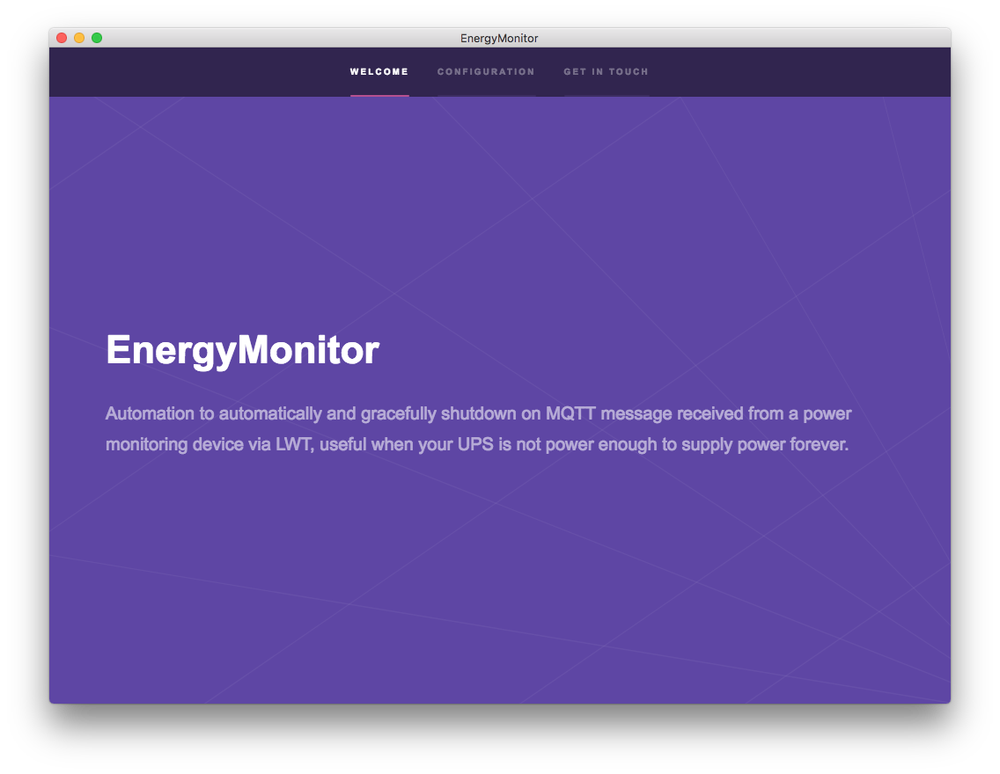

# MQTT Energy Monitor

Menu bar application to automatically shutdown your system on MQTT message received from a power monitoring device via LWT, useful when your UPS is not power enough to supply power forever or without easy cable/wireless interface.
On Mac OS, no administrator privilegies required

## Use case

- Plug your embedded device monitor to a not protected power socket and connected to your mqtt broker or to your self hosted computer broker (use localhost in settings)
- Start this tool on startup
- On blackout, after notification, your system will be gracefully turned off.

## Configuration

You can use the GUI to fully configure settings, and also debug mode. If enabled it will show a notification instead fully shutdown your system. 

### Disclaimer 

- I will release source code for contribution soon
- Full tested on Mac OS, work in progress for Windows.
